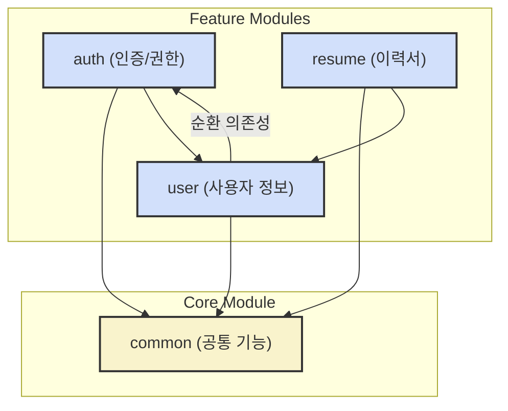

```mermaid
graph TD
    subgraph "Feature Modules"
        Auth["auth (인증/권한)"]
        User["user (사용자 정보)"]
        Resume["resume (이력서)"]
    end

    subgraph "Core Module"
        Common["common (공통 기능)"]
    end

    User --> Common
    Auth --> Common
    Resume --> Common

    Auth --> User
    Resume --> User
    User -- "순환 의존성" --> Auth

    classDef feature fill:#D2E0FB,stroke:#333,stroke-width:2px;
    classDef core fill:#F9F3CC,stroke:#333,stroke-width:2px;

    class Auth,User,Resume feature
    class Common core
```